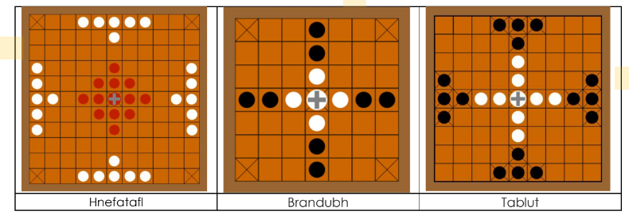
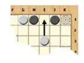
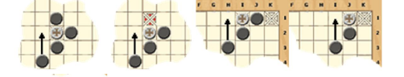

# Tabuleiro-Hnefatafl-Design-Pattern_-1-
Trabalho da Materia de Padrões de Projeto

Esse código consiste na implementação do jogo de tabuleiro **Hnefatafl**, utilizando padrões de projetos. O jogo permite que duas pessoas joguem uma contra a outra, no mesmo computador.
Junto ao código, contém um Artigo em PDF identificando o uso do padrão de projeto.

O Jogo deve permitir a escolha entre três tipos de tabuleiros, conforme visto na imagem de baixo:

**Regras do jogo:**  
* Defensores correspondem ao grupo do centro, com o Rei representado pela cruz. O grupo da extremidade refere-se aos mercenários.
* Inicia com os defensores. Os jogadores alternam movendo uma peça por turno.
* Qualquer peça (mesmo o Rei) pode mover qualquer quantidade de casas horizontal ou verticalmente (mas não diagonalmente), tal como a torre no Xadrez, mas nunca saltar sobre as outras peças.
* Também é possível, conforme combinação dos jogadores, as peças moverem somente 1 quadrado (ter essa opção na inicialização do jogo).
* Também é possível, conforme combinação dos jogadores, o Rei mover 1 ou 4 quadrados.
* Somente o Rei pode ocupar a casa central (trono) e uma das casas dos quatro cantos (refúgios).
* Após mover o Rei, e existir um caminho livre para um dos refúgios, o jogador deve falar “Raichi!” para avisar o oponente.
* Mercenários vencem se conseguem capturar o Rei sueco
* Defensores vencem se conseguirem conduzir o seu Rei para um dos cantos (refúgio)
* Se após mover o Rei, existirem caminhos livres para dois refúgios, o jogador deve falar “Tuichi!” e termina o jogo. 
* As peças de ambos os lados podem ser capturadas.
* A peça é capturada quando é cercada por duas peças do adversário, formando um sanduíche com a peça do oponente.
* A peça também pode ser capturada se for encurralada entre um inimigo e o trono, ou um inimigo e um refúgio.
* Podem ser capturadas mais de uma peça simultaneamente. No exemplo abaixo são capturadas duas peças pretas.

* O Rei pode participar de uma captura como os seus soldados.
* Uma peça pode se meter entre duas peças inimigas num movimento. Nessa situação ela não é capturada.
* Existem quatro formas de capturar o rei.

* Se o Rei estiver em perigo de ser capturado, os Mercenários devem avisar “Olha o Rei”. 

